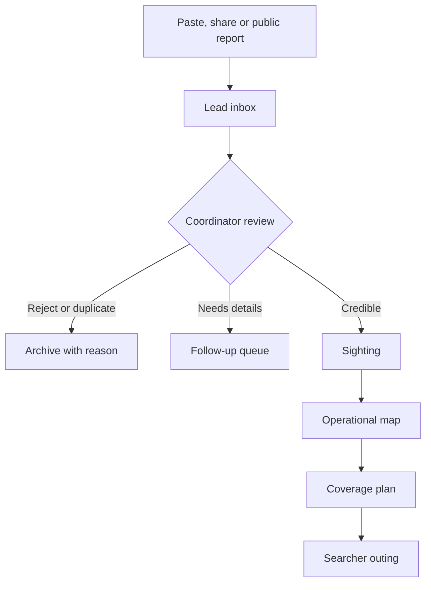

# Operativo Pancite — Cursor Build Brief

Status: implementation-ready product contract  
Primary case: Pancite/Panza, a missing black female poodle  
Primary operators: owner, sister, brother-in-law  
Default language: Spanish (Argentina)  
Target: mobile-first installable web app; public open-source repository

## Cursor instruction

Place this file in the repository root and give Cursor this prompt:

> Read `OPERATIVO_PANCITE_BUILD_BRIEF.md` completely and treat it as the source of truth. First inspect the repository and preserve all working behavior. If the repository is empty, scaffold the stack specified below with Yarn. Implement Milestone 1 as a complete vertical slice, including tests, Firebase rules and the demo seed. Run typecheck, lint, unit tests and production build. Stop after Milestone 1, report what works, what remains, and any decision that genuinely requires human input. Do not implement autonomous Facebook scraping, speculative animal-location prediction, multi-tenant billing, or unrelated redesigns.

After Milestone 1 is verified, ask Cursor to continue one milestone at a time.

---

## 1. Product definition

### 1.1 One sentence

Operativo Pancite turns scattered sightings, social posts, signs and family search outings into one verified, shared operational map.

### 1.2 Actual outcome

The app succeeds when it reduces the time between a credible sighting and a coordinated response while preventing duplicated or unsafe field work.

### 1.3 Deployment model

- MVP: one active missing-animal case per deployment.
- All records are nevertheless scoped by `caseId`.
- This keeps the first app simple for three family operators while allowing later multi-case support without rewriting the data model.
- Public users never join the private workspace. They only use a fast report form.
- Open-source adopters can fork and configure their own deployment.

### 1.4 Product principles

1. Mobile first; usable one-handed while walking.
2. Save evidence immediately; enrichment can happen later.
3. Observed time and reported time are always distinct.
4. Unverified reports never move the official search zone.
5. Current member locations, reporter contact details and avoidance zones remain private.
6. The map shows uncertainty honestly; it must not pretend to predict the animal.
7. Core actions require no GIS vocabulary.
8. External integrations are replaceable adapters, not foundations.
9. Spanish copy first; strings are kept in an i18n dictionary from day one.

## 2. Users and permissions

### 2.1 Roles

#### Public reporter

- No account.
- Can send a possible sighting.
- Can share GPS, photo, direction and contact details voluntarily.
- Cannot read private reports, team locations, avoidance zones or operational plans.

#### Searcher

- Invite-only Google sign-in.
- Reads the operational map.
- Adds signs, coverage and outing progress.
- Can paste social-media evidence into the inbox.
- Cannot change case-level policy or delete evidence.

#### Coordinator

- Everything a searcher can do.
- Reviews leads and sightings.
- Confirms/rejects sightings.
- Draws the official zone and private avoidance areas.
- Assigns coverage and outings.

#### Owner

- Everything a coordinator can do.
- Manages members, case profile, public contact destination and exports.
- Can archive, never silently destroy, operational records.

### 2.2 Initial membership

- Owner: G.
- Two invited family members: sister and brother-in-law.
- Do not hard-code names or emails. Use a Firestore membership collection and an owner bootstrap email supplied through deployment configuration.

## 3. Information architecture

### 3.1 Private app

Bottom navigation has only three entries:

1. **Mapa** — operational truth.
2. **Bandeja** — pasted posts and public reports requiring review.
3. **Plan** — coverage, assignments and outings.

A persistent primary action opens a short action sheet:

- Posible avistaje
- Pegar publicación
- Cartel colocado
- Empezar recorrido

Settings, members and export live behind the case header menu.

### 3.2 Public surface

`/c/:slug` contains:

- Animal photo and concise identifying details.
- Large **LA ESTOY VIENDO** button.
- Secondary **CREO QUE LA VI** button.
- Call and WhatsApp links configured by the owner.
- Minimal guidance: do not chase; observe direction; photograph safely; report immediately.

Do not expose the private map by default. A coordinator may publish a deliberately coarse public area later.

### 3.3 Core flow



## 4. Core objects

Use Zod schemas, strict TypeScript types and Firestore converters for every stored object. Store timestamps as Firestore timestamps, not formatted strings. GeoJSON coordinates use `[longitude, latitude]`.

### 4.1 Case

`cases/{caseId}`

- `slug`
- `status`: `active | found | archived`
- `animal`: name, aliases, species, breed, color, sex, size, distinguishing marks, photos
- `locale`: default `es-AR`
- `distanceUnit`: `km | mi`
- `mapCenter`
- `publicContact`: display phone and WhatsApp destination
- `publicInstructions`
- `zonePolicy`: manually selected default radius and units
- `createdAt`, `updatedAt`

The case document is private. Firestore cannot hide individual fields in an otherwise readable document, so public pages read a separate projection:

`publicCases/{slug}`

- `caseId`
- `status`
- Owner-approved animal profile and photos
- Owner-approved contact actions and instructions
- Optional deliberately coarse public area
- `updatedAt`

Only a trusted function or the owner/coordinator publication flow updates this projection.

### 4.2 Member

`cases/{caseId}/members/{uid}`

- `role`: `owner | coordinator | searcher`
- `displayName`
- `email`
- `active`
- `createdAt`, `lastSeenAt`

### 4.3 Lead

A lead is raw incoming evidence, not yet an accepted sighting.

`cases/{caseId}/leads/{leadId}`

- `origin`: `public_form | facebook | instagram | whatsapp | other`
- `sourceUrl?`
- `rawText?`
- `attachmentPaths[]`
- `sourcePublishedAt?`
- `capturedAt`
- `capturedByUid?`; absent for public reports
- `reporter`: private name, phone, preferred contact
- `claimedObservationAt?`
- `claimedLocationText?`
- `claimedPoint?`
- `claimedDirection?`
- `parserSuggestions`: proposed dates, locations, phones, keywords
- `status`: `new | needs_details | duplicate | rejected | promoted`
- `duplicateOf?`
- `reviewNotes?`
- `promotedSightingId?`

### 4.4 Sighting

`cases/{caseId}/sightings/{sightingId}`

- `observedAt`
- `reportedAt`
- `point`
- `accuracyMeters?`
- `direction`: compass direction or drawn bearing
- `movement`: `moving | stationary | hidden | unknown`
- `confidence`: `unverified | probable | confirmed | rejected`
- `evidence`: lead ids, photos and source links
- `description`
- `createdByUid`
- `reviewedByUid?`, `reviewedAt?`
- `affectsOfficialZone`: true only when coordinator-approved

Changing confidence or official-zone influence must create an audit event.

### 4.5 Sign location

`cases/{caseId}/signs/{signId}`

- `point`
- `placeName?`
- `tier`: `A | B | C | D`
- `placeType`
- `status`: `planned | placed | missing | damaged | removed`
- `placedAt?`, `lastCheckedAt?`, `nextCheckAt?`
- `staffPersonallyAlerted`: boolean
- `photoPath?`
- `notes?`
- `createdByUid`
- `posterCode`: unique short code/QR destination

Default tiers are configurable:

- A: 24-hour human presence—service stations, police, guards, emergency facilities, 24-hour kiosks.
- B: animal network—vets, pet shops, groomers, walkers, shelters.
- C: high transit—supermarkets, stations, schools, pharmacies, clubs.
- D: ordinary street placement.

### 4.6 Coverage cell

Generate stable cells with H3; do not persist thousands of empty cells.

`cases/{caseId}/coverage/{cellId}` exists only after interaction:

- `status`: `assigned | walked | signed | revisit`
- `assignedToUid?`
- `assignedOutingId?`
- `lastCoveredAt?`
- `coverageMethod`: `walk | drive | signs | interview | camera_check`
- `notes?`

Cell size is a case setting. Begin around a walkable block-scale size and expose a human label such as “manzana pequeña,” not an H3 resolution number.

### 4.7 Outing

`cases/{caseId}/outings/{outingId}`

- `title`
- `status`: `planned | active | completed | cancelled`
- `memberUids[]`
- `plannedCellIds[]`
- `plannedSignIds[]`
- `startPoint?`
- `plannedRoute?`: GeoJSON
- `actualTrack?`: simplified GeoJSON
- `startedAt?`, `endedAt?`
- `liveLocationExpiresAt?`
- `notes?`

### 4.8 Avoidance area

`cases/{caseId}/avoidAreas/{areaId}`

- `name`: neutral private label
- `geometry`: GeoJSON polygon
- `reason`: optional private note
- `active`
- `createdByUid`

Avoidance areas are never included in public payloads or analytics.

### 4.9 Zone version

`cases/{caseId}/zones/{zoneId}`

- `geometry`: GeoJSON circle-derived polygon, ellipse, polygon or corridor
- `status`: `draft | active | superseded`
- `basisSightingIds[]`
- `radiusValue?`, `radiusUnit?`
- `createdByUid`, `createdAt`
- `activatedByUid?`, `activatedAt?`
- `supersedesZoneId?`

There is exactly one active zone. Activation is a coordinator transaction that supersedes the previous version and creates an audit event.

### 4.10 Ephemeral live location

`cases/{caseId}/liveLocations/{uid}`

- `outingId`
- `point`, `accuracyMeters?`
- `updatedAt`
- `expiresAt`: server-enforced TTL/validity deadline

Clients must treat expired records as absent even before backend cleanup runs.

### 4.11 Audit event

`cases/{caseId}/audit/{eventId}`

- actor, action, object type/id, before/after summary, timestamp

At minimum audit sighting verification, official-zone changes, member changes and evidence deletion/archive.

## 5. Paste/share intake

This is a primary feature, not an admin afterthought.

### 5.1 Interface

The Bandeja screen begins with one large surface:

> **Pegá o compartí cualquier cosa**  
> Texto, enlace, captura o foto

It accepts:

- Plain text pasted from a post.
- A Facebook/Instagram/other URL.
- Clipboard image.
- Drag/drop or file picker.
- Mobile camera photo.
- Web Share Target payload when the installed PWA and browser support it.

There must not be separate “Facebook URL,” “post text,” and “screenshot” forms before capture. Detect what arrived and show a combined preview.

### 5.2 Save-first behavior

1. Immediately create a local draft in IndexedDB.
2. Upload raw evidence and create the lead.
3. Show **Guardado** as soon as persistence succeeds.
4. Run OCR/parser work lazily afterward.
5. Let the operator leave without locating or classifying the post.

The capture flow must still save when OCR fails, a URL cannot be fetched, or no location is present.

### 5.3 Facebook boundary

- Do not automate Facebook login, feed browsing or scraping.
- Do not attempt to fetch authenticated Facebook post content from the backend.
- A Facebook URL is evidence and attribution; it may remain inaccessible to other members.
- Encourage adding a screenshot or copied text when a URL alone contains no usable content.
- Meta discontinued the ordinary Groups API and prohibits automated collection without permission. The app must not pretend this constraint can be engineered away.

References:

- [Meta Graph API v19 changelog](https://developers.facebook.com/docs/graph-api/changelog/version19.0/)
- [Meta Terms](https://www.facebook.com/terms/)
- [Meta Content Library](https://transparency.meta.com/researchtools/meta-content-library/)

### 5.4 OCR and parsing

MVP parsing is assistive; humans remain authoritative.

- Lazy-load Tesseract.js in a Web Worker for screenshots.
- Preserve the original image and OCR text separately.
- Detect candidate phone numbers, dates, times, cross-streets and common sighting verbs with deterministic rules.
- Highlight suggestions for one-tap confirmation.
- Never silently convert a parsed location into a confirmed map point.
- Provide an optional future server-side parser interface, but no API key or paid AI dependency is required for MVP.

### 5.5 Deduplication

On creation, compute available fingerprints:

1. Canonicalized source URL hash.
2. Normalized text hash.
3. Attachment SHA-256.
4. Optional perceptual image hash later.

Potential duplicates remain visible and require confirmation. Never delete evidence automatically.

### 5.6 Inbox card

Each lead card shows:

- Source icon.
- Evidence preview.
- Claimed date/location if known.
- Capture age.
- Status and duplicate warning.
- Primary actions: **Ubicar**, **Promover**, **Descartar**.

“Promote” opens a compact review sheet for observed time, point, direction and confidence. The raw lead stays linked.

## 6. Sightings and active zone

### 6.1 Sightings

Map markers communicate confidence through shape and opacity as well as color. Every marker opens a card with:

- “Visto” timestamp.
- “Informado” timestamp.
- Confidence.
- Direction arrow.
- Evidence thumbnails/links.
- Reviewer and notes.

Rejected sightings remain available behind a filter so the team does not repeatedly investigate the same post.

### 6.2 Official zone

The coordinator owns the zone. The application assists but does not predict.

- Draw circle, ellipse, polygon or directional corridor.
- Choose radius in case units.
- “Center on last confirmed sighting” is a convenience, not automatic truth.
- New confirmed sightings can propose a new center/corridor; a coordinator must accept it.
- Preserve a versioned zone history with author and timestamp.
- Timeline mode can display how official zones and sightings changed over time.

The ambiguous “3ml” requirement is intentionally configurable: choose 3 km or 3 mi (4.8 km) at runtime rather than hard-coding either.

### 6.3 Initial seed

Keep this in a replaceable demo/import file, never in application logic:

- Main recorded sighting: San Ramón and Maipú, 17:30, heading toward 9 de Julio.
- Earlier focus: Cemetery of Olivos and surroundings.
- Florida Oeste should not become active merely from old/discarded reports; it requires credible new evidence.

The seed must not contain private phone numbers or reporter identities in the public repository.

## 7. Signs

### 7.1 Add sign

From the map or quick action:

1. Use current location or tap the map.
2. Select tier/place type.
3. Mark planned or placed.
4. Optional photo and note.
5. Ask one explicit question: **¿Alguien del lugar quedó avisado?**

### 7.2 QR posters

Every sign receives a short public URL such as `/p/:posterCode` and corresponding QR code.

- Opening it shows the case public report page.
- Reports retain `posterCode` so the team knows which sign generated the lead.
- Owners can download a print-ready QR block for insertion into the existing poster.

### 7.3 Maintenance

The Plan screen creates a small maintenance queue:

- Never checked after placement.
- Damaged/missing.
- Due for recheck.
- High-tier locations first.

Do not invent biological movement logic to schedule signs. Recheck intervals are coordinator settings.

## 8. Coverage and outings

### 8.1 Coverage

Within the active zone, generate H3 cells on demand. A cell can be assigned, covered or marked for revisit.

- Searchers can claim/unclaim cells.
- The map distinguishes planned work from completed work.
- Coverage fades visually with age; it does not disappear.
- “Nothing seen” is recorded as effort, not as proof that the animal was absent.

### 8.2 Plan outing

Input:

- Member(s).
- Available minutes.
- Walking/driving.
- Starting point.
- Desired work: signs, street coverage, camera checks or mixed.

MVP output:

- A manually reorderable checklist of cells/sign targets.
- Estimated distance where available.
- **Start outing** action.

Later routing can use a server-side openrouteservice adapter with walking profiles and private avoid polygons. Routes must be labelled “review before starting”; no routing service guarantees personal safety.

Reference: [openrouteservice routing options](https://giscience.github.io/openrouteservice/api-reference/endpoints/directions/routing-options)

### 8.3 Live location

- Off by default.
- Starts only after an explicit **Compartir durante este recorrido** action.
- Coarse update interval by default; do not stream second-by-second.
- Stops when the outing ends.
- Server-side expiry removes/invalidates stale live locations even if the phone crashes.
- A one-time **Actualizar mi ubicación** button remains available.
- The public never receives this data.

Background PWA tracking is platform-dependent. MVP should work correctly with foreground tracking and one-time updates before adding native/background complexity.

## 9. Urgent public report

### 9.1 “La estoy viendo”

Designed for completion in roughly 30 seconds:

1. Request current GPS after explicit consent.
2. Default observed time to now.
3. Ask direction with eight large compass buttons plus “quieta/no sé.”
4. Optional photo.
5. Required phone or WhatsApp contact unless the reporter explicitly chooses anonymous.
6. Submit.

After submission:

- Show the configured call and WhatsApp actions.
- Show concise guidance to observe without chasing or endangering themselves.
- Create a high-priority lead.
- Notify signed-in team clients in real time.
- Use web push through Firebase Cloud Messaging when configured.

### 9.2 Abuse controls

Public writes go through a callable/HTTP Cloud Function, not direct unrestricted Firestore writes.

- Firebase App Check where practical.
- Per-IP/case rate limiting.
- Honeypot field.
- Payload and image size limits.
- Server timestamps.
- No public query endpoint for reporter details.

Do not let spam reports produce official sightings or shift zones.

## 10. Privacy and safety contract

### 10.1 Public data

- Case name and animal profile.
- Owner-selected contact action.
- Owner-written reporting guidance.
- Optional deliberately coarse public area.

### 10.2 Private data

- Reporter identities and contact details.
- Raw social screenshots where access/privacy is uncertain.
- Exact team/member locations and outing tracks.
- Avoidance polygons and reasons.
- Internal notes and rejected evidence.

### 10.3 Retention

- Reporter contact details should be exportable and deletable by the owner.
- Live locations expire automatically.
- Evidence deletion is a soft archive first, with audit history.
- Provide **Found / Close case**: disables new urgent alerts and location sharing while preserving an export.

### 10.4 Firestore rules

Rules must enforce membership and role, not rely on hidden UI.

- Public may read only a sanitized public case document.
- Public cannot list leads or sightings.
- Members read only cases where they have an active membership.
- Searchers cannot promote/verify sightings or manage members.
- Coordinator/owner can verify and manage zones.
- Only owner manages members and case closure.
- Storage rules mirror evidence visibility.

Add emulator tests proving these boundaries.

## 11. Technical stack

Use current stable compatible versions at implementation time; do not pin versions from this document blindly.

- Yarn.
- React + Vite + strict TypeScript.
- React Router.
- Firebase Auth, Firestore, Storage, Cloud Functions and optional FCM.
- React Leaflet/Leaflet with a configurable OpenStreetMap-compatible tile provider and visible attribution.
- Zod + React Hook Form.
- H3 for stable coverage cells.
- Turf.js for circles, corridors and GeoJSON operations.
- IndexedDB through a small adapter for offline drafts/queued captures.
- Tesseract.js lazy-loaded in a Web Worker.
- `vite-plugin-pwa` for installability and Web Share Target support.
- Vitest + Testing Library.
- Playwright for critical mobile flows.
- Firebase Emulator Suite for rules/integration tests.

Use CSS variables and a restrained component layer. Tailwind is acceptable if already present; do not introduce it solely to avoid writing a small stylesheet.

### 11.1 Suggested structure

```text
src/
  app/
  domain/
  features/
    cases/
    intake/
    leads/
    sightings/
    map/
    signs/
    coverage/
    outings/
    public-report/
  lib/
    firebase/
    geo/
    offline/
    routing/
  i18n/
functions/
firestore.rules
storage.rules
seed/
```

Prefer feature-local components and tests. Avoid a generic `components/` dumping ground and avoid one-file abstractions used only once.

### 11.2 Operational requirements

- `.env.example` with explanations and no secrets.
- Firebase project setup guide.
- Tile/routing/OCR providers behind small interfaces.
- Error reporting contains no raw reporter phone or location.
- Images compressed client-side before upload while originals remain optional.
- Map and OCR chunks lazy-loaded.
- Public page loads without downloading private app code where feasible.
- Minimum touch target approximately 44 px.
- Keyboard and screen-reader labels for all core actions.

## 12. Milestones

Each milestone must end with typecheck, lint, tests and production build passing. Preserve unrelated existing behavior. Do not begin the next milestone until the current one is usable end-to-end.

### Milestone 1 — Working vertical slice

Goal: family can capture and verify one lead; public can report one sighting.

- Project foundation, PWA shell and Spanish i18n.
- Google sign-in and case membership roles.
- Sanitized public case page.
- `La estoy viendo` form through protected Cloud Function.
- Private Bandeja with paste text/URL/image capture.
- Save-first local draft and Firestore lead.
- Coordinator promotes lead to sighting.
- Operational map displays sighting markers and evidence card.
- Manual confidence; unverified versus confirmed distinction.
- Firebase rules and emulator tests.
- Demo seed and local setup docs.

Hard stop: no OCR, coverage grid, routing, live tracking or autonomous browsing yet.

### Milestone 2 — Signs and zones

- Add/edit/filter sign pins and tiers.
- Staff-alerted question.
- QR poster code and public attribution.
- Manual active-zone drawing and history.
- Radius units configurable km/mi.
- Timeline/filter controls for sightings.
- Sign maintenance queue.

### Milestone 3 — Coverage and outings

- H3 coverage overlay.
- Assign/claim/complete/revisit cells.
- Plan outing checklist.
- Foreground track with explicit start/stop.
- One-time location update.
- Automatic live-location expiry.
- Offline queued field actions.

### Milestone 4 — Friction removal

- Web Share Target.
- Lazy client-side OCR.
- Deterministic parser suggestions.
- Deduplication warnings.
- Push notification opt-in.
- Camera-check task type.

### Milestone 5 — Assisted routing

- Routing provider adapter.
- openrouteservice integration through backend.
- Avoid-area routing request.
- Reorderable proposed route.
- Clear safety/review language.
- Graceful manual fallback when routing is unavailable.

### Milestone 6 — Open-source release

- Setup wizard or documented configuration.
- Generic demo animal and sanitized Panza import example.
- Architecture, privacy and threat-model notes.
- Contribution guide and issue templates.
- English string set after Spanish UX stabilizes.
- Choose and document license. Suggested decision: AGPL-3.0 if hosted improvements should remain open; MIT if maximal adoption is more important.

## 13. Acceptance scenarios

### 13.1 Social lead

1. Sister copies text and a Facebook URL.
2. Opens Bandeja and pastes once.
3. The app immediately saves a new lead.
4. She closes the app before classification.
5. G opens the same lead, adds observed time and map point, selects probable, and promotes it.
6. It appears on all three private maps.
7. The original text, URL and capture time remain attached.

### 13.2 Screenshot-only lead

1. Brother-in-law pastes a screenshot with no URL.
2. It is saved even if OCR is unavailable.
3. Later OCR suggestions never overwrite the original.
4. A coordinator can locate or reject it.

### 13.3 Public live report

1. Reporter scans a poster QR.
2. Taps **La estoy viendo**.
3. Grants one-time GPS, chooses direction and enters phone.
4. Submission creates a private high-priority lead linked to that poster.
5. Team members receive an in-app real-time alert.
6. Reporter details are not publicly queryable.

### 13.4 False report

1. A public report arrives with a distant or suspicious claim.
2. It appears only in Bandeja.
3. It does not change the active zone.
4. Coordinator rejects it with a reason.
5. The evidence remains searchable behind a filter.

### 13.5 Field coverage

1. Coordinator assigns cells and high-tier signs to an outing.
2. Searcher starts it and explicitly enables temporary location sharing.
3. Marks covered cells and placed signs while walking.
4. Ends the outing.
5. Location updates stop and later expire server-side.
6. Coverage remains dated and visible to the team.

### 13.6 Authorization

- Anonymous users cannot list private data.
- Searchers cannot confirm sightings.
- Coordinators cannot remove the owner.
- Archived members lose access immediately.
- Direct Firestore calls cannot bypass these rules.

## 14. Non-goals

Do not build these into MVP:

- Autonomous Facebook/Instagram scraping or credentialed browser agents.
- A probability heatmap presented as scientific prediction.
- Automatic confirmation based on OCR or AI.
- Public display of searcher locations or avoidance zones.
- Second-by-second background GPS.
- A general social network, chat system or volunteer marketplace.
- Multi-organization billing and platform administration.
- Complex automatic POI harvesting.
- Native Android/iOS apps before the PWA proves the workflow.

## 15. Quality gates

Before calling any milestone complete:

1. The acceptance scenarios for that milestone work at a narrow mobile viewport.
2. No horizontal overflow on primary screens.
3. A failed upload, denied location, unavailable clipboard and offline transition each have a recoverable state.
4. Firestore and Storage rules have negative tests, not only happy-path tests.
5. No private collection is reachable from public loaders or client bundles through an unauthenticated query.
6. Unverified leads cannot alter official-zone state through UI or direct writes.
7. All source URLs and raw text render safely; never inject post HTML.
8. Build, typecheck, lint and tests pass without suppressing errors.
9. README setup works from a clean clone.
10. No secret, personal phone, reporter identity, service-account key or other private credential is committed.

## 16. Definition of useful MVP

The MVP is useful—not merely demonstrable—when the three family operators can do all of the following from their phones:

- Sign in and see the same map.
- Paste any combination of social post text, link and screenshot in one place.
- Save incomplete evidence without losing it.
- Review, reject or promote a lead.
- Record a dated, directed sighting with honest confidence.
- Place and maintain tiered sign pins.
- Draw and adjust the active search/sign zone.
- Divide ground without duplicating work.
- Receive and act on a public “I see her now” report.
- Keep exact operational and personal data private.

Everything else is secondary until this loop works reliably.
