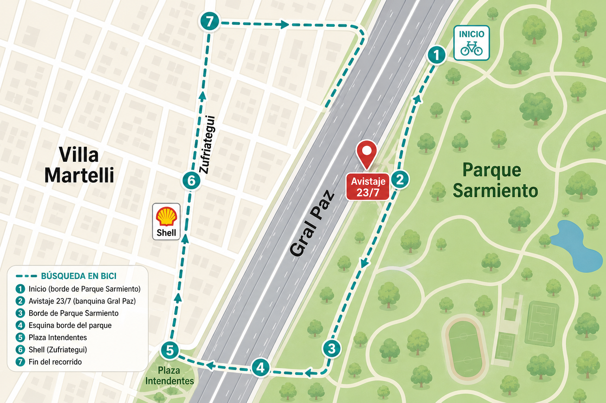

# Recorrido bici — Panza 24/7

Loop ~4–5 km. **No entrar a la calzada de Gral Paz** — mirar banquina desde Zufriategui / borde parque.

## Abrir ahora

### Google Maps · modo bici (multi-parada)

https://www.google.com/maps/dir/?api=1&origin=-34.5508,-58.5055&destination=-34.5538,-58.5158&waypoints=-34.5492,-58.5068%7C-34.551,-58.508%7C-34.5528,-58.5128%7C-34.5552,-58.5142%7C-34.5578,-58.5162&travelmode=bicycling

### Waze · inicio del loop

https://waze.com/ul?ll=-34.5508,-58.5055&navigate=yes&zoom=17

### Pin avistaje 23/7

- Maps: https://www.google.com/maps/search/?api=1&query=-34.551,-58.508
- Waze: https://waze.com/ul?ll=-34.551,-58.508&navigate=yes&zoom=18

## Paradas

1. Inicio · acceso Parque Sarmiento / Gral Paz — `-34.5508, -58.5055`
2. Borde parque · pista / Plazoleta El Ombú — `-34.5492, -58.5068`
3. Pin avistaje 23/7 — `-34.551, -58.508`
4. Zufriategui Norte — `-34.5528, -58.5128`
5. Zufriategui × Chile/Perú — `-34.5552, -58.5142`
6. Zona Shell (desde paralelo) — `-34.5578, -58.5162`
7. Cierre · Plaza Intendentes — `-34.5538, -58.5158`

Si la ves: no agarrar · seguir · **1156194761** / **1130400210**
